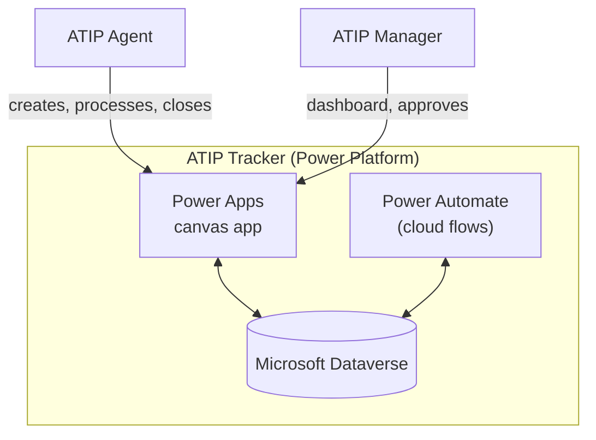

# ATIP Request Tracker

*[Version française](README.md)*

> A fictitious internal application that lets a federal department's Access to Information and Privacy (ATIP) office receive, track, and process access requests, in compliance with the legal 30-day deadline and extensions — built entirely on Microsoft Power Platform.

🚧 **Status: in active development.** The Dataverse schema and demo data are in place; the canvas app is being built screen by screen. Screenshots and a demo will be added at the end of Phase 2. Track progress in [docs/](docs/).

## Roadmap

- [x] **Phase 0** — Repository structure, README, architecture documentation
- [x] **Phase 1** — Dataverse schema (tables, columns, relationships) and fictitious demo data
- [ ] **Phase 2** — Canvas app, screen by screen *(in progress)*
- [ ] **Phase 3** — Power Automate flows
- [ ] **Phase 4** — Security and roles
- [ ] **Phase 5** — ALM and GitHub Actions
- [ ] **Phase 6** — Accessibility and bilingualism testing
- [ ] **Phase 7** — Final documentation, screenshots, case study

## Features

- Track an ATIP request (Access to Information / Privacy) from intake to closure
- Automatic calculation of the legal 30-day deadline, with extension handling
- Dashboard: counters by status, overdue requests or requests due within 5 days
- Timestamped activity log per request
- Automatic reminders to agents via a daily scheduled flow
- Fully bilingual FR/EN application (no hardcoded text), WCAG 2.1 AA compliant
- Least-privilege security roles: ATIP Agent and ATIP Manager

## Architecture

Full diagrams (context, components, request lifecycle): [docs/architecture.md](docs/architecture.md)

## Stack

- **Microsoft Dataverse** (developer environment, Power Apps Developer Plan)
- **Power Apps** — canvas app, Power Fx formulas
- **Power Automate** — cloud flows
- **Power Platform solution** (`gk` prefix) + **Power Platform CLI** (`pac`) for ALM
- **GitHub Actions** (`microsoft/powerplatform-actions`) for checking and packaging
- **Documentation**: Markdown + Mermaid, published with MkDocs Material

## Documentation

| Document | Content |
|---|---|
| [Architecture](docs/architecture.md) | Context, component, and lifecycle diagrams |
| [Data model](docs/modele-donnees.md) | ERD and Dataverse data dictionary |
| [Power Automate flows](docs/flux.md) | Triggers, steps, error handling |
| [Security](docs/securite.md) | Roles, least privilege, classification |
| [Accessibility](docs/accessibilite.md) | WCAG 2.1 AA / EN 301 549 checklist |
| [Official languages](docs/langues-officielles.md) | Bilingual FR/EN approach |
| [ALM](docs/alm.md) | Solution, environments, variables, pipeline |
| [Installation](docs/installation.md) | Deploying the solution to another environment |
| [User guide](docs/guide-utilisateur.md) | Using the application, with screenshots |
| [ADR](docs/adr/) | Architecture decisions, one per option considered |
| [Case study](docs/portfolio-etude-de-cas.md) | Problem, role, solution, results, lessons learned |
| [Interview prep](docs/entrevue.md) | 60-second pitch and likely questions |

## GC compliance

As a demonstration project, this repository reflects the following principles:

- **Government of Canada Digital Standard**: user-centred, iterative design, open by default (public repository, documented decisions).
- **Official languages**: fully bilingual French/English interface, no hardcoded text in the application.
- **Accessibility**: targets WCAG 2.1 AA / EN 301 549 — see [docs/accessibilite.md](docs/accessibilite.md).
- **Access to Information Act**: the 30-day processing deadline and extension mechanism are faithfully reproduced in the data model and flows.

## ⚠️ Fictitious data

All data used in this project (requests, names, emails, request subjects) is **entirely fictitious** and generated for demonstration purposes only. No real data or real personal information is used.

## Author

**Gween Kangah** — [gweenkangah.pro](https://gweenkangah.pro) — [github.com/itsGween](https://github.com/itsGween)
