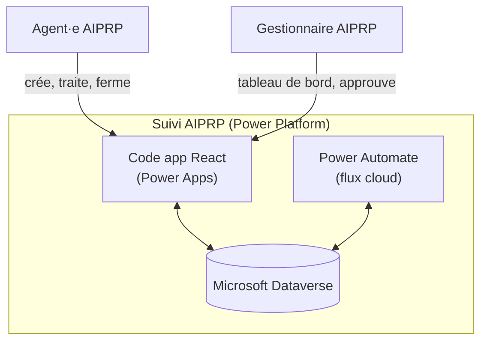

# Suivi AIPRP

*[English version](README.en.md)*

> Application interne fictive permettant au bureau d'accès à l'information et de protection des renseignements personnels (AIPRP) d'un ministère fédéral de recevoir, suivre et traiter ses demandes d'accès, dans le respect du délai légal de 30 jours et des prorogations — entièrement construite sur Microsoft Power Platform.

🚧 **Statut : en cours de développement.** Le schéma Dataverse et les données de démo sont en place ; le front-end (Power Apps code app en React) est en construction. Captures d'écran et démonstration ajoutées à la fin de la Phase 2. Voir l'avancement dans [docs/](docs/).

## Feuille de route

- [x] **Phase 0** — Structure du dépôt, README, documentation d'architecture
- [x] **Phase 1** — Schéma Dataverse (tables, colonnes, relations) et données de démo fictives
- [ ] **Phase 2** — Code app React (Power Apps), écran par écran *(en cours)*
- [ ] **Phase 3** — Flux Power Automate
- [ ] **Phase 4** — Sécurité et rôles
- [ ] **Phase 5** — ALM et GitHub Actions
- [ ] **Phase 6** — Tests d'accessibilité et de bilinguisme
- [ ] **Phase 7** — Documentation finale, captures, étude de cas

## Fonctionnalités

- Suivi d'une demande AIPRP (Accès à l'information / Renseignements personnels) de la réception à la fermeture
- Calcul automatique de l'échéance légale de 30 jours, avec gestion des prorogations
- Tableau de bord : compteurs par statut, demandes en retard ou à moins de 5 jours de l'échéance
- Journal d'activité horodaté par demande
- Rappels automatiques aux agent·es par flux planifié quotidien
- Application bilingue FR/EN (aucun texte codé en dur) et conforme WCAG 2.1 AA
- Rôles de sécurité à moindre privilège : Agent AIPRP et Gestionnaire AIPRP

## Architecture

Diagrammes complets (contexte, composants, cycle de vie d'une demande) : [docs/architecture.md](docs/architecture.md)

## Stack

- **Microsoft Dataverse** (environnement développeur, Power Apps Developer Plan)
- **Power Apps code app** — React + TypeScript + Vite, hébergée et gouvernée par Power Platform (authentification Microsoft Entra, connecteurs, DLP)
- **React Router**, contexte React pour le bilinguisme FR/EN
- **Playwright + axe-core** — tests automatisés d'accessibilité WCAG 2.1 AA
- **Système de design GC (GCDS)** — via npm, empaqueté localement (voir [ADR 0002](docs/adr/0002-canvas-vs-code-app.md))
- **Power Automate** — flux cloud
- **Solution Power Platform** (préfixe `gk`) + **Power Platform CLI** (`pac`) et **Power Apps CLI** (`pa`) pour l'ALM
- **GitHub Actions** (`microsoft/powerplatform-actions`) pour la vérification et le packaging
- **Documentation** : Markdown + Mermaid, publiée avec MkDocs Material

## Documentation

| Document | Contenu |
|---|---|
| [Architecture](docs/architecture.md) | Diagrammes de contexte, de composants et de cycle de vie |
| [Modèle de données](docs/modele-donnees.md) | ERD et dictionnaire de données Dataverse |
| [Flux Power Automate](docs/flux.md) | Déclencheurs, étapes, gestion d'erreurs |
| [Sécurité](docs/securite.md) | Rôles, moindre privilège, classification |
| [Accessibilité](docs/accessibilite.md) | Liste de contrôle WCAG 2.1 AA / EN 301 549 |
| [Langues officielles](docs/langues-officielles.md) | Approche de bilinguisme FR/EN |
| [ALM](docs/alm.md) | Solution, environnements, variables, pipeline |
| [Installation](docs/installation.md) | Déployer la solution dans un autre environnement |
| [Guide utilisateur](docs/guide-utilisateur.md) | Utilisation de l'application, avec captures |
| [ADR](docs/adr/) | Décisions d'architecture, une par option envisagée |
| [Étude de cas](docs/portfolio-etude-de-cas.md) | Problème, rôle, solution, résultats, apprentissages |
| [Entrevue](docs/entrevue.md) | Pitch 60 secondes et questions probables |

## Conformité GC

Ce projet illustre, à titre de démonstration, les principes suivants :

- **Norme numérique du gouvernement du Canada** : conception centrée sur les utilisateur·rices, itérative, ouverte par défaut (dépôt public, décisions documentées).
- **Langues officielles** : interface entièrement bilingue français/anglais, aucun texte codé en dur dans l'application.
- **Accessibilité** : cible WCAG 2.1 AA / EN 301 549 — voir [docs/accessibilite.md](docs/accessibilite.md).
- **Loi sur l'accès à l'information** : le délai de traitement de 30 jours et le mécanisme de prorogation sont reproduits fidèlement dans le modèle de données et les flux.

## ⚠️ Licence

Ce projet utilise une **Power Apps code app** (préversion). Le [Power Apps Developer Plan](https://learn.microsoft.com/power-platform/developer/plan) couvre entièrement le développement et les tests. En production, les **utilisateurs finaux** ont besoin d'une licence **Power Apps Premium** (ou d'un accès par utilisation, d'un App Pass, ou d'une attribution automatique) — voir [docs/securite.md](docs/securite.md).

## ⚠️ Données fictives

Toutes les données utilisées dans ce projet (demandes, noms, courriels, objets de demande) sont **entièrement fictives** et générées à des fins de démonstration uniquement. Aucune donnée réelle, aucun renseignement personnel réel n'est utilisé.

## Auteure

**Gween Kangah** — [gweenkangah.pro](https://gweenkangah.pro) — [github.com/itsGween](https://github.com/itsGween)
