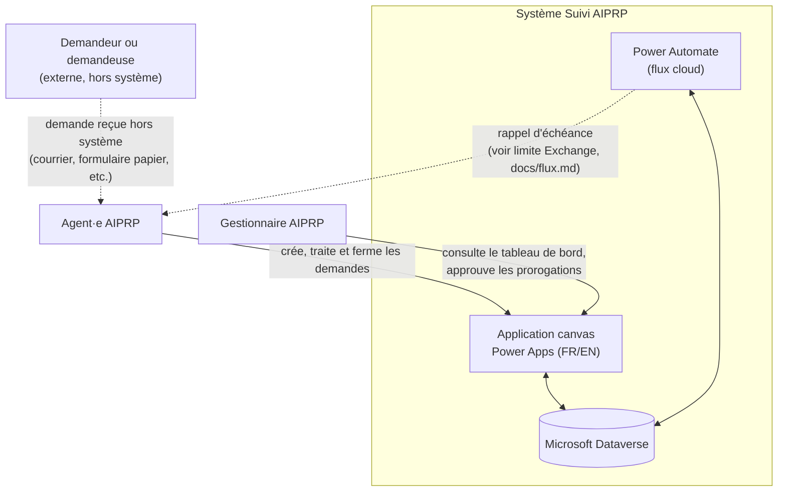
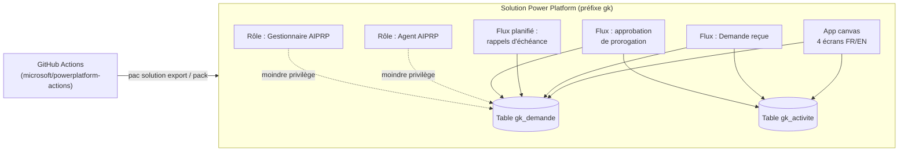
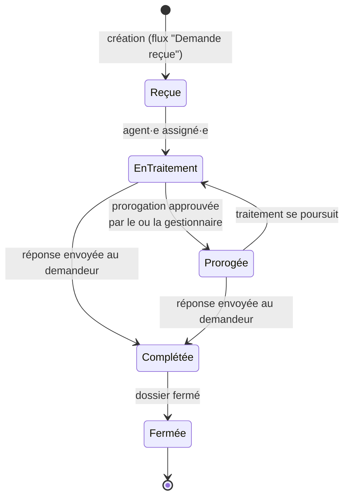

# Architecture

Ce document présente l'architecture du Suivi AIPRP à trois niveaux : le contexte (qui interagit avec le système), les composants (ce que contient la solution Power Platform) et le cycle de vie d'une demande (comment une demande circule dans le système).

Les décisions structurantes (Dataverse plutôt que SharePoint, application canvas plutôt que modèle-pilotée) sont documentées séparément dans les [ADR](adr/).

## 1. Diagramme de contexte

Qui utilise le système et avec quoi le système communique.

**Notes :**

- Le ou la demandeuse externe n'a **pas** accès au système — les demandes AIPRP sont reçues par d'autres canaux (courrier, formulaire) puis saisies par l'agent·e. Ce périmètre volontairement simple évite d'exposer Dataverse à des utilisateurs externes non authentifiés.
- Le tenant de développement n'a pas de licence Exchange/Outlook ; l'envoi de courriels réels est donc remplacé par une alternative documentée dans [flux.md](flux.md).

## 2. Diagramme de composants

Ce que contient la solution Power Platform (préfixe `gk`).

**Notes :**

- Chaque composant (écran, flux, table, rôle) est détaillé dans son propre document : [modele-donnees.md](modele-donnees.md), [flux.md](flux.md), [securite.md](securite.md).
- La solution est exportée, vérifiée (Solution Checker) et empaquetée en solution gérée par le pipeline GitHub Actions — détails dans [alm.md](alm.md).

## 3. Cycle de vie d'une demande

Comment le statut d'une demande (`gk_demande`) évolue, du dépôt à la fermeture.

**Notes :**

- La date d'échéance (colonne formule = date de réception + 30 jours) est fixée à la création et ne change **que** si une prorogation est approuvée.
- Chaque transition de statut ajoute une entrée dans le journal `gk_activite` (date, auteur, action, commentaire) — voir [modele-donnees.md](modele-donnees.md).
- Le flux planifié quotidien lit le statut et l'échéance de chaque demande active pour déclencher les rappels décrits dans [flux.md](flux.md).
