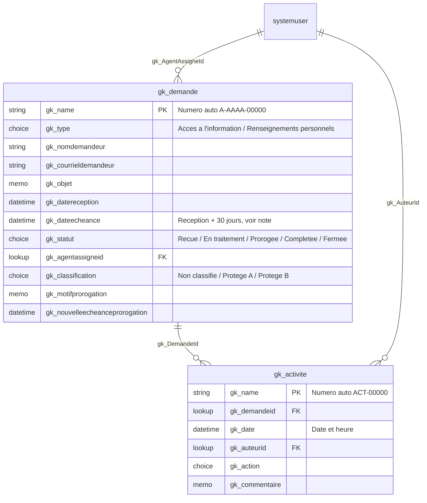

# Modèle de données

Le schéma est créé par script (API Web Dataverse, appelée en PowerShell) plutôt qu'à la main dans le
Centre d'administration — voir [scripts/New-DataverseSchema.ps1](../scripts/New-DataverseSchema.ps1) et
[scripts/New-DemoData.ps1](../scripts/New-DemoData.ps1) pour les données fictives. Le script est idempotent :
le relancer ne duplique rien, il détecte ce qui existe déjà.

Éditeur : `Gween Kangah - AIPRP` (préfixe `gk`). Solution : `SuiviAIPRP`.

## Diagramme entité-relation

## Pourquoi l'échéance n'est pas une colonne formule

Le prompt initial du projet demandait une « colonne formule » pour l'échéance (réception + 30 jours).
Techniquement, ce n'est pas possible telle quelle : une colonne formule Dataverse (Power Fx) est en
**lecture seule** — jamais modifiable par un flux. Or le flux de prorogation (Phase 3) doit justement
réécrire cette date si une prorogation est approuvée.

**Décision** : `gk_dateecheance` est une colonne `DateTime` normale, que le flux « Demande reçue »
remplit à `reception + 30 jours` au moment de la création (Phase 3), et que le flux de prorogation
réécrit en cas d'approbation. Le résultat visible est identique à une colonne formule ; c'est seulement
le calcul (flux plutôt que Dataverse) qui change.

Pour la même raison, **« jours restants »** n'est stocké nulle part dans Dataverse : cette valeur dépend
de la date du jour (non déterministe), donc une colonne formule Dataverse ne peut pas la calculer. Elle
sera calculée côté client dans la code app React (Phase 2), par exemple avec une fonction utilitaire
`joursRestants(dateEcheance: string): number` basée sur `Date`.

## Dictionnaire de données — `gk_demande`

| Colonne | Type | Détails |
|---|---|---|
| `gk_name` | Texte (numéro auto) | Colonne primaire, format `A-{AAAA}-{00000}`, ex. `A-2026-00001` |
| `gk_type` | Choix | Accès à l'information (100000000) / Renseignements personnels (100000001) |
| `gk_nomdemandeur` | Texte (200) | Requis. Donnée fictive. |
| `gk_courrieldemandeur` | Texte (200, format courriel) | Donnée fictive. |
| `gk_objet` | Texte multiligne (2000) | |
| `gk_datereception` | Date | Requis. |
| `gk_dateecheance` | Date | Voir note ci-dessus. |
| `gk_statut` | Choix | Reçue (100000010, défaut) / En traitement (…11) / Prorogée (…12) / Complétée (…13) / Fermée (…14) |
| `gk_agentassigneid` | Référence → `systemuser` | Relation `gk_systemuser_demandes_agent` |
| `gk_classification` | Choix | Non classifié (100000020, défaut) / Protégé A (…21) / Protégé B (…22) |
| `gk_motifprorogation` | Texte multiligne (2000) | Rempli si prorogée. |
| `gk_nouvelleecheanceprorogation` | Date | Rempli si prorogée. |

## Dictionnaire de données — `gk_activite`

| Colonne | Type | Détails |
|---|---|---|
| `gk_name` | Texte (numéro auto) | Colonne primaire, format `ACT-{00000}` |
| `gk_demandeid` | Référence → `gk_demande` | Relation `gk_demande_activites`, requis |
| `gk_date` | Date et heure | Requis. |
| `gk_auteurid` | Référence → `systemuser` | Relation `gk_systemuser_activites_auteur` |
| `gk_action` | Choix | Demande reçue / Changement de statut / Commentaire ajouté / Prorogation demandée / Prorogation approuvée / Fermeture |
| `gk_commentaire` | Texte multiligne (2000) | |

## Données de démonstration

⚠️ Toutes les données créées par `scripts/New-DemoData.ps1` sont **fictives** : 15 demandes couvrant
les cinq statuts (dont des demandes en retard et proches de l'échéance, pour tester le tableau de bord
en Phase 2), avec leur journal d'activité cohérent. L'environnement de développement n'ayant qu'un seul
compte utilisateur réel, ce compte (`Gween Kangah`) est utilisé comme agent assigné et auteur pour
toutes les données de démo — une limite documentée plutôt que cachée.

Voir aussi [ADR 0001](adr/0001-dataverse-vs-sharepoint.md) (choix de Dataverse) et le survol dans
[architecture.md](architecture.md).
